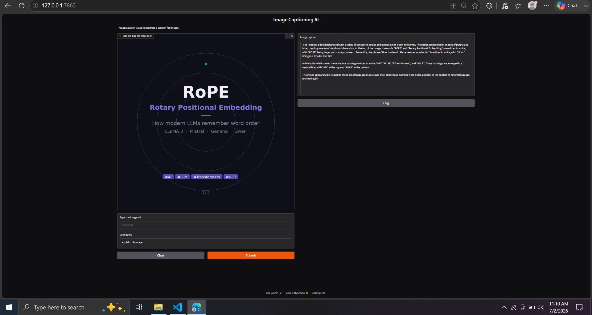

# 🔍 PixelQuery

**Ask questions about images. Get short, sharp answers — powered by SmolVLM2.**

PixelQuery is a lightweight pipeline for visual question answering. Feed it an image (local file or URL), ask it something in plain English, and it hands back a concise, 1–2 sentence response using Hugging Face's `SmolVLM2-2.2B-Instruct` model.

No fine-tuning, no fuss — just point it at pixels and start asking.

---


### Local Image with Q&A Generation


### URL of Image with Q&A Generation


---

## ✨ What it does

- **Loads images from anywhere** — local paths or remote URLs, single or batch
- **Normalizes everything to RGB** so the model always gets a clean input
- **Runs inference through SmolVLM2**, a compact vision-language model that punches above its weight
- **Keeps answers tight** — the system prompt is tuned to return brief, focused responses instead of rambling descriptions
- **Fails loudly, not silently** — validation errors and request failures are logged and raised, not swallowed

---

## 🗂️ Project structure

```
.
├── modules/
│   ├── logger.py              # Shared logging setup
│   ├── data_extraction.py     # Image loading & encoding (local + URL)
│   └── model_config.py        # Model loading + inference logic
└── README.md
```

> Adjust the tree above to match your actual file names if they differ.

---

## ⚙️ How it works

### 1. Load your image(s)

```python
from modules.data_extraction import encode_image, encode_images

# Single image
image = encode_image(url="https://example.com/cat.jpg")
# or
image = encode_image(image_path="./images/cat.jpg")

# Multiple images at once
images = encode_images(urls=["https://example.com/a.jpg", "https://example.com/b.jpg"])
```

### 2. Ask a question

```python
from modules.model_config import get_response_from_model

answer = get_response_from_model(image, "What is the cat doing?")
print(answer)
```

That's it. Under the hood, PixelQuery builds a chat-style message, runs it through SmolVLM2's processor and generation pipeline, and strips the prompt tokens back out so you only get the model's reply.

---

## 🧠 The model

| | |
|---|---|
| **Model** | [`HuggingFaceTB/SmolVLM2-2.2B-Instruct`](https://huggingface.co/HuggingFaceTB/SmolVLM2-2.2B-Instruct) |
| **Precision** | `bfloat16` |
| **Device** | CUDA if available, otherwise CPU |
| **Max new tokens** | 200 |
| **Decoding** | Greedy (`do_sample=False`) for deterministic answers |

---

## 🚀 Getting started

```bash
pip install torch transformers pillow requests
```

> The model will download automatically on first run via `from_pretrained`. A GPU is recommended — CPU inference will work but will be noticeably slower.

```python
from modules.data_extraction import encode_image
from modules.model_config import get_response_from_model

image = encode_image(image_path="sample.jpg")
print(get_response_from_model(image, "Describe the mood of this scene."))
```

---

## 🛡️ Error handling

Both the extraction and inference layers validate their inputs up front and log failures with context before re-raising:

- Empty URLs, missing image paths, and blank queries raise `ValueError` immediately
- Network issues while fetching remote images are caught and logged
- Model inference failures are logged with the underlying exception for easy debugging

---

## 🗺️ Roadmap ideas

- [ ] Batch inference across multiple images in a single call
- [ ] Configurable answer length instead of a fixed system prompt
- [ ] Simple CLI or FastAPI wrapper for quick demos
- [ ] Caching for repeated URL fetches

---

*Built for anyone who'd rather ask an image a question than stare at it in silence.*
